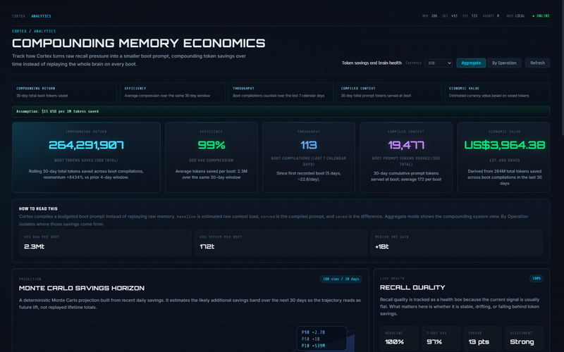
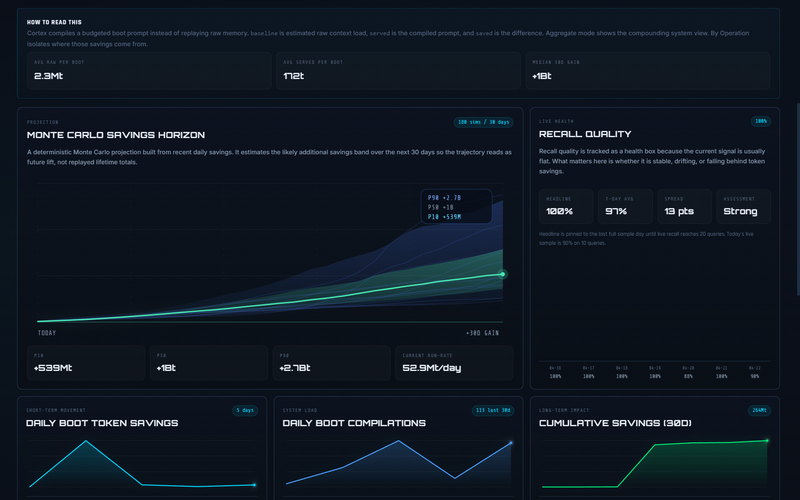
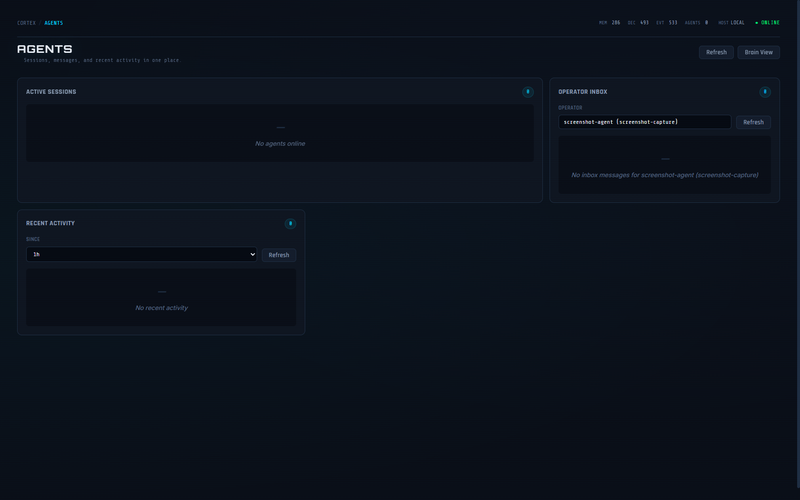
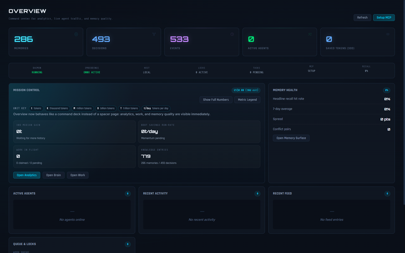
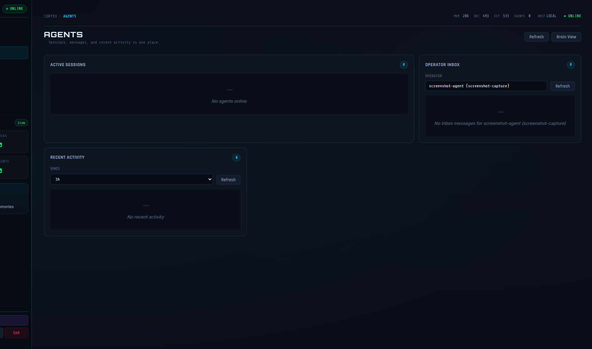

<p align="center">
  
</p>

<h1 align="center">Cortex</h1>
<p align="center"><b>Private local memory for your AI tools.</b><br>
Install once. Your tools stop starting from scratch.</p>

<p align="center">
  <a href="https://ko-fi.com/adityavg13">
    
  </a>
</p>

<p align="center">
  <a href="https://github.com/AdityaVG13/cortex/releases/tag/v0.5.0"></a>&nbsp;
  <a href="LICENSE"></a>&nbsp;
  &nbsp;
  
</p>

<p align="center">
  <a href="https://github.com/AdityaVG13/cortex/releases/latest">Download</a>&nbsp;&nbsp;·&nbsp;&nbsp;
  <a href="Info/connecting.md">Connect your tools</a>&nbsp;&nbsp;·&nbsp;&nbsp;
  <a href="CHANGELOG.md">What's new</a>&nbsp;&nbsp;·&nbsp;&nbsp;
  <a href="Info/roadmap.md">Roadmap</a>
</p>

<p align="center">
  &nbsp;&nbsp;
  &nbsp;&nbsp;
  &nbsp;&nbsp;
  &nbsp;&nbsp;
  
</p>

---

<p align="center">
  🔒 <b>Private by default</b>: localhost only, data never leaves your machine<br>
  🔗 <b>One memory, every tool</b>: HTTP and MCP, same brain, no per-tool silos<br>
  📊 <b>Prove it works</b>: token savings, recall quality, and Monte Carlo projections
</p>

---


<table>
<tr>
<td align="center" valign="top">
<br>
<h3>❌ Without Cortex</h3>
<p>
Session 1 &nbsp;→&nbsp; explain preferences<br>
Session 2 &nbsp;→&nbsp; explain them again<br>
Session 3 &nbsp;→&nbsp; and again, new tool<br>
Session 14 &nbsp;→&nbsp; still explaining<br><br>
<b>~15,000 tokens wasted</b>
</p>
<br>
</td>
<td align="center" valign="top">
<br>
<h3>✅ With Cortex</h3>
<p>
Session 1 &nbsp;→&nbsp; store once<br>
Session 2 &nbsp;→&nbsp; boot, already knows<br>
Session 3 &nbsp;→&nbsp; boot, already knows<br>
Session 14 &nbsp;→&nbsp; boot, still knows<br><br>
<b>~300 tokens per boot (97% less)</b>
</p>
<br>
</td>
</tr>
</table>

---


<p align="center">
  &nbsp;&nbsp;
  &nbsp;&nbsp;
  &nbsp;&nbsp;
  &nbsp;&nbsp;
  
</p>

<table align="center">
<tr>
<td align="center" width="33%">

**`POST /store`**

Save decisions, lessons, preferences. Conflict detection is automatic.

</td>
<td align="center" width="33%">

**`GET /recall`**

Hybrid keyword + semantic search. In-process ONNX embeddings, no external service.

</td>
<td align="center" width="33%">

**`GET /boot`**

Compiled identity + delta capsule. ~300 tokens served instead of ~15,000 raw.

</td>
</tr>
</table>

---


<p align="center">Memory tools are easy to pitch and hard to trust. Cortex starts to matter when the savings stop looking theoretical.</p>

<table>
<tr>
<td width="50%">

<p align="center"><b>📊 Analytics</b></p>

<p align="center"><sub>Savings, compression, and activity heatmaps</sub></p>

</td>
<td width="50%">

<p align="center"><b>📈 Monte Carlo</b></p>

<p align="center"><sub>30-day projection with confidence bands</sub></p>

</td>
</tr>
<tr>
<td width="50%">

<p align="center"><b>🤖 Agents</b></p>

<p align="center"><sub>Live sessions, inbox, deduped by identity</sub></p>

</td>
<td width="50%">

<p align="center"><b>🎛️ Overview</b></p>

<p align="center"><sub>Memory counts, health, and navigation</sub></p>

</td>
</tr>
</table>

---


<p align="center">Measured against a 20-query ground-truth dataset on every release via the <code>cortex-http-base</code> adapter. A fully helper-free <code>cortex-http-pure</code> adapter lands in v0.6.0 to establish the canonical core baseline.</p>

<table align="center">
<tr>
<th></th>
<th align="center">v0.4.1</th>
<th align="center">v0.5.0</th>
<th align="center">Δ</th>
</tr>
<tr>
<td align="center"><b>Precision</b></td>
<td align="center">55.2%</td>
<td align="center"><b>87.5%</b></td>
<td align="center">📈 +32.3%</td>
</tr>
<tr>
<td align="center"><b>MRR</b></td>
<td align="center">69.2%</td>
<td align="center"><b>95.0%</b></td>
<td align="center">📈 +25.8%</td>
</tr>
<tr>
<td align="center"><b>Top-1 hit</b></td>
<td align="center">90.0%</td>
<td align="center"><b>90.0%</b></td>
<td align="center">—</td>
</tr>
<tr>
<td align="center"><b>Avg query tokens</b></td>
<td align="center">n/a</td>
<td align="center"><b>48.4</b></td>
<td align="center">—</td>
</tr>
</table>

<p align="center">
<sub><a href="benchmarking/results/raw-recall-no-helper-dev-20260421-224217.json">Raw v0.5.0 JSON</a></sub><br>
<sub>Note: <code>cortex-http-base</code> ("raw") adapter retains partial adapter-layer helpers and is deprecated for new quality claims. The helper-free <code>cortex-http-pure</code> adapter ships in v0.6.0 as the canonical measurement floor -- every v0.6.0+ recall-quality claim is measured through it, enforced by 5 CI purity gates. See <a href="benchmarking/README.md">benchmarking/README.md</a>. Reranking production-ships in v0.6.0 Phase 2; query expansion (HyDE) targeted for v0.7.0.</sub>
</p>

---


<p align="center">349 commits since v0.4.1. Full details in <a href="CHANGELOG.md">CHANGELOG.md</a>.</p>

### Retrieval

- **Reciprocal rank fusion**: query-adaptive keyword/semantic weighting
- **Crystal family recall**: collapsed members cut token cost, preserve context
- **Synonym-expanded keywords** across all retrieval paths
- FTS tokenizer upgrade and BM25 tuning
- Entity-alignment boost, co-occurrence expansion

### Reliability

- Schema migration framework with upgrade regression tests
- DB integrity gate, rolling backups, crash-safe WAL
- Storage pressure governor with event-pressure controls
- Persistent savings rollups for long-window analytics
- DB footprint: 720 MB → 386 MB in a real install

### Agent intelligence

- **Feedback telemetry**: record outcomes, track reliability over time
- **Recall explainability**: see why results ranked the way they did
- **Conflict detection**: AGREES / CONTRADICTS / REFINES / UNRELATED
- **Client permissions**: read / write / admin gates per agent

### Security

- Localhost exempt from auth-failure lockout
- Non-loopback binds require TLS
- API key masking on non-interactive stdout
- Remote targets need explicit token (no silent auto-load)
- Team-mode destructive ops require admin + rated auth

---


<p align="center">Cortex tracks active agent sessions when clients identify themselves through <code>cortex_boot</code> or <code>GET /boot?agent=NAME</code>.</p>

<table>
<tr>
<td width="55%">



</td>
<td width="45%" valign="top">

### Multi-agent, one brain

- Each boot call registers a session. Control Center shows active sessions, **deduplicated by agent identity**.
- Read-path tools (recall, peek, unfold) reattach to existing sessions. No duplicates.
- Session descriptions preserved across reconnects and daemon restarts.
- What one agent stores, every other agent can recall.

Claude Code, Codex, Cursor, and custom scripts can all be connected simultaneously. Each tracks its own session while sharing the same memory.

</td>
</tr>
</table>

---


<div align="center">

| Tool | Connection | Setup |
|------|-----------|-------|
| **Claude Code** | MCP (plugin) or desktop app | Plugin: `claude plugin install cortex@cortex-marketplace` |
| **Codex** | MCP | `codex mcp add cortex -- cortex.exe mcp --agent codex` |
| **Cursor** | MCP | Point MCP server at `cortex mcp --agent cursor` |
| **Factory Droid** | MCP | `cortex mcp --agent droid` |
| **Aider** | CLI / HTTP | `cortex boot --agent aider` |
| **Custom tools** | HTTP | Three endpoints: `/boot`, `/recall`, `/store` |
| **Local LLMs** | HTTP / MCP | Same protocol, any runtime |

</div>

<p align="center">Full setup guide: <a href="Info/connecting.md"><b>Info/connecting.md</b></a></p>

---


<p align="center"><b>Desktop app (Control Center)</b><br>
Download from the <a href="https://github.com/AdityaVG13/cortex/releases/latest">release page</a>. The Control Center manages daemon lifecycle for you.</p>

<div align="center">

| Platform | Desktop installer | Daemon archive |
|----------|------------------|----------------|
| **Windows** | [`.exe` (NSIS installer)](https://github.com/AdityaVG13/cortex/releases/latest) | [`.zip`](https://github.com/AdityaVG13/cortex/releases/latest) |
| **macOS** | [`.dmg`](https://github.com/AdityaVG13/cortex/releases/latest) | [`.tar.gz`](https://github.com/AdityaVG13/cortex/releases/latest) |
| **Linux** | [`.AppImage` / `.deb`](https://github.com/AdityaVG13/cortex/releases/latest) | [`.tar.gz`](https://github.com/AdityaVG13/cortex/releases/latest) |

</div>

<p align="center"><b>From source</b></p>

```bash
git clone https://github.com/AdityaVG13/cortex.git
cd cortex/daemon-rs
cargo build --release
```

<p align="center"><b>Claude Code plugin</b></p>

```bash
claude plugin marketplace add AdityaVG13/cortex
claude plugin install cortex@cortex-marketplace
```

<p align="center">The plugin handles daemon startup, health checks, and MCP bridging automatically.</p>

---


<p align="center">Cortex enforces a <b>single-daemon invariant</b>: only one daemon process runs at a time.</p>

<div align="center">

| Mode | How it works |
|------|-------------|
| **Desktop app** | Control Center owns the daemon. Restart and monitor from the app. |
| **CLI** | `cortex serve` starts the daemon. Exits cleanly if one is already running. |
| **Plugin** | `cortex plugin ensure-daemon` attaches to an existing daemon or starts one. |

</div>

<p align="center">Default bind: <code>127.0.0.1:7437</code>. Non-loopback binds require TLS. Auth token at <code>~/.cortex/cortex.token</code>.<br>
If using the Control Center, manage the daemon from there. Do not run a second <code>cortex serve</code> alongside it.</p>

---


<p align="center">After installing, verify everything works:</p>

```bash
# Start the daemon (skip if using Control Center)
cortex serve &

# Health check (no auth required)
curl http://localhost:7437/health

# Boot test
TOKEN=$(cat ~/.cortex/cortex.token)
curl -H "Authorization: Bearer $TOKEN" \
     -H "X-Cortex-Request: true" \
     "http://localhost:7437/boot?agent=smoke-test"

# Store and recall round-trip
curl -X POST http://localhost:7437/store \
     -H "Content-Type: application/json" \
     -H "Authorization: Bearer $TOKEN" \
     -H "X-Cortex-Request: true" \
     -d '{"decision": "smoke test", "context": "verifying install"}'

curl -H "Authorization: Bearer $TOKEN" \
     -H "X-Cortex-Request: true" \
     "http://localhost:7437/recall?q=smoke+test"
```

<details>
<summary>Development build verification</summary>

```bash
# Daemon unit tests
cargo test --manifest-path daemon-rs/Cargo.toml

# Desktop test suite
npm --prefix desktop/cortex-control-center test

# Lifecycle smoke test
npm --prefix desktop/cortex-control-center run verify:lifecycle:dev

# Security audit
npm audit --omit=dev --audit-level=high
cargo audit
```

</details>

---


<div align="center">

| Document | Covers |
|----------|--------|
| **[Connecting](Info/connecting.md)** | Setup, MCP, HTTP, auth, troubleshooting |
| **[MCP Tools](Info/mcp-tools.md)** | All 28 MCP tool definitions and parameters |
| **[Research](Info/research.md)** | Papers, inspirations, adaptation notes |
| **[Roadmap](Info/roadmap.md)** | What shipped, what's planned, and why |
| **[Security](Info/security-rules.md)** | Threat model, auth rules, vulnerability reporting |
| **[Team mode](Info/team-mode-setup.md)** | Shared-server setup for engineering teams |
| **[Contributing](CONTRIBUTING.md)** | Development setup and PR guidelines |

</div>

<details>
<summary>CLI reference</summary>

| Command | Description |
|---------|-------------|
| `cortex serve` | Start the daemon |
| `cortex --help` | Full command reference |
| `cortex doctor` | Run diagnostics |
| `cortex paths --json` | Show file and port paths |
| `cortex plugin ensure-daemon` | Ensure daemon health (plugin mode) |
| `cortex plugin mcp` | MCP stdio bridge to HTTP API |
| `cortex setup --team` | Initialize team mode and generate API keys |
| `cortex export` | Export data (json or sql) |
| `cortex import` | Import from a previous export |
| `cortex admin rollback --session-id <id>` | Soft-delete a session's memory writes (dry-run default; `--apply` to persist) |

</details>

---


<p align="center">Cortex defaults to localhost-only access with bearer-token auth.<br>
Full threat model, auth rules, and vulnerability reporting: <a href="Info/security-rules.md"><b>Info/security-rules.md</b></a></p>

---


<details>
<summary>💾 <b>How much disk space does Cortex use?</b></summary>
<br>
The daemon binary is ~30 MB. The SQLite database grows with usage. A real install with 286 memories and 493 decisions uses ~386 MB after compaction. The ONNX embedding model (~50 MB) downloads on first run.
</details>

<details>
<summary>🤖 <b>Can multiple agents write to Cortex at the same time?</b></summary>
<br>
Yes. SQLite WAL mode handles concurrent reads and serialized writes. Each agent maintains its own session while sharing the same memory. Conflict detection handles contradictions automatically.
</details>

<details>
<summary>🔒 <b>Does Cortex send any data externally?</b></summary>
<br>
No. In solo mode, Cortex runs entirely on localhost. No telemetry, no phone-home, no cloud sync. Team mode sends data only to the configured team server over your network.
</details>

<details>
<summary>🔄 <b>What happens if the daemon crashes mid-session?</b></summary>
<br>
The MCP proxy detects daemon death and restarts automatically (bounded to 3 attempts with backoff). SQLite WAL mode ensures no data corruption. Sessions survive transient crashes.
</details>

<details>
<summary>🧹 <b>How do I reset Cortex to a clean state?</b></summary>
<br>
Delete <code>~/.cortex/cortex.db</code> and restart the daemon. A new empty database and auth token are generated. Settings and model files are preserved.
</details>

---

<p align="center"><b>Built by</b></p>

<p align="center">
  <a href="https://github.com/AdityaVG13/cortex/graphs/contributors">
    
  </a>
</p>

---

<p align="center">
  <a href="https://ko-fi.com/adityavg13"><b>☕ Support Cortex</b></a>&nbsp;&nbsp;·&nbsp;&nbsp;
  <a href="Info/research.md">Research</a>&nbsp;&nbsp;·&nbsp;&nbsp;
  <a href="Info/connecting.md">Connecting</a>&nbsp;&nbsp;·&nbsp;&nbsp;
  <a href="Info/security-rules.md">Security</a>&nbsp;&nbsp;·&nbsp;&nbsp;
  <a href="CONTRIBUTING.md">Contributing</a>&nbsp;&nbsp;·&nbsp;&nbsp;
  <a href="CODE_OF_CONDUCT.md">Code of Conduct</a>&nbsp;&nbsp;·&nbsp;&nbsp;
  <a href="CHANGELOG.md">Changelog</a>&nbsp;&nbsp;·&nbsp;&nbsp;
  <a href="LICENSE">MIT License</a>
</p>
