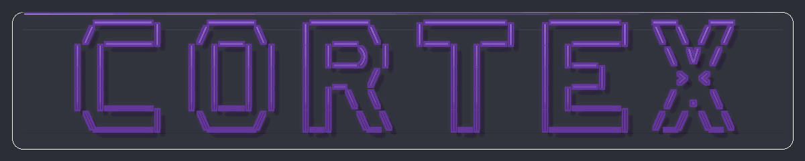
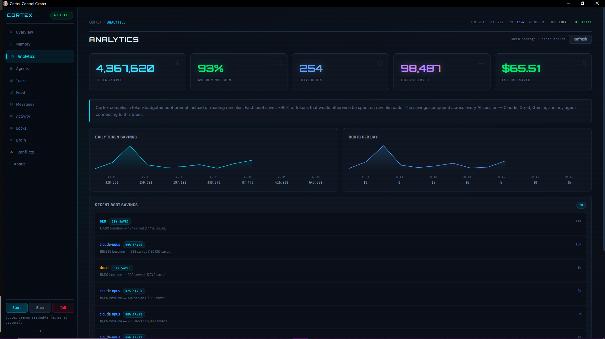
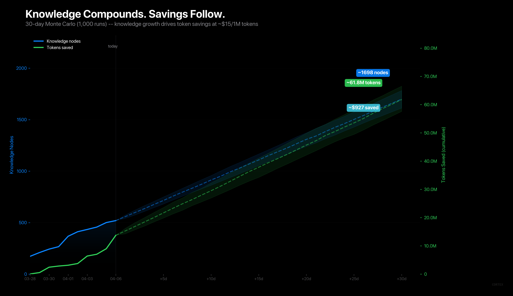

<p align="center"><strong>Local-first memory for coding agents.</strong></p>

<p align="center">
  
</p>

<h1 align="center">One durable brain.<br>Every tool you use.</h1>
<p align="center">
  Cortex gives Claude Code, Codex, Cursor, Gemini, and local LLM workflows a shared brain that survives restarts,
  compresses boot context, and stays on your machine.
</p>

<p align="center">
  <a href="https://github.com/AdityaVG13/cortex/releases/latest">Get started</a> |
  <a href="Info/connecting.md">Connect your tools</a> |
  <a href="Info/research.md">Read the research</a>
</p>

<p align="center">
  <sub>v0.4.1 &nbsp;&nbsp;|&nbsp;&nbsp; Rust + ONNX &nbsp;&nbsp;|&nbsp;&nbsp; MCP-native &nbsp;&nbsp;|&nbsp;&nbsp; MIT</sub>
</p>

<p align="center">
  <a href="https://ko-fi.com/adityavg13"><strong>Support Cortex</strong></a> funds releases, benchmarks, app polish, and long-term maintenance.
</p>

<p align="center">
  <strong>Cortex exists for one reason:</strong> memory should feel like infrastructure, not a party trick.
</p>

<table align="center">
  <tr>
    <td width="190" align="center"><strong>10.7M</strong><br><sub>boot tokens saved</sub></td>
    <td width="190" align="center"><strong>99%</strong><br><sub>avg compression</sub></td>
    <td width="190" align="center"><strong>90%</strong><br><sub>benchmark hit rate</sub></td>
    <td width="190" align="center"><strong>97.5ms</strong><br><sub>avg recall latency</sub></td>
  </tr>
</table>

## Start in two commands

If you want the shortest path from "that looks interesting" to "this is helping," use the Claude Code plugin. Cortex handles daemon lifecycle for you.

```bash
claude plugin marketplace add AdityaVG13/cortex
claude plugin install cortex@cortex-marketplace
```

Restart your session and Cortex boots itself. Prefer installers or a source build? Jump to [more install options](#more-install-options).

## See the payoff

Memory products are easy to demo and hard to trust. Cortex only gets interesting once the savings show up on screen.

<p align="center">
  
</p>

<p align="center"><em>Live Cortex analytics: saved tokens, compression, recall quality, boot history, and agent activity in one operator surface.</em></p>

The Control Center is there to answer the uncomfortable question fast: "Is this thing actually paying for itself?" If the answer is no, you should know that immediately. If the answer is yes, the page makes it obvious.

<p align="center">
  
</p>

<p align="center"><em>Monte Carlo savings horizon: a 30-day projection built from real Cortex benchmark data, not marketing math.</em></p>

Source notes: live savings and compression figures come from the current Control Center surface. Retrieval metrics come from [`benchmark/baseline-v041.md`](benchmark/baseline-v041.md).

## Why teams keep it running

<table align="center">
  <tr>
    <td width="360" valign="top" align="left">
      <strong>Shared memory, not siloed memory</strong><br>
      <sub>One local daemon serves the same memory to Claude Code, Codex, Cursor, Gemini, and your own tooling.</sub>
    </td>
    <td width="360" valign="top" align="left">
      <strong>Smaller boots, less repetition</strong><br>
      <sub><code>cortex_boot</code> compiles a smaller prompt from stable memory plus recent delta instead of replaying raw history.</sub>
    </td>
  </tr>
  <tr>
    <td width="360" valign="top" align="left">
      <strong>Decisions stop disappearing</strong><br>
      <sub>Architecture rules, review preferences, and bug fixes stay queryable through MCP and HTTP instead of getting buried in scrollback.</sub>
    </td>
    <td width="360" valign="top" align="left">
      <strong>Operators can see what changed</strong><br>
      <sub>The Control Center shows savings, recall quality, and agent activity, so memory stays inspectable instead of mystical.</sub>
    </td>
  </tr>
</table>

## Works with your stack

<table align="center">
  <tr>
    <td width="240" valign="top" align="center">
      <strong>Claude Code</strong><br>
      <sub>Primary plugin path with lifecycle handled for you.</sub>
    </td>
    <td width="240" valign="top" align="center">
      <strong>Codex</strong><br>
      <sub>Native MCP bridge plus HTTP fallback when you need it.</sub>
    </td>
    <td width="240" valign="top" align="center">
      <strong>Cursor</strong><br>
      <sub>Shared local memory through the same daemon instead of a separate silo.</sub>
    </td>
  </tr>
  <tr>
    <td width="240" valign="top" align="center">
      <strong>Gemini</strong><br>
      <sub>Works through MCP for CLI and tool-driven workflows.</sub>
    </td>
    <td width="240" valign="top" align="center">
      <strong>Local LLMs</strong><br>
      <sub>Use HTTP or MCP from your own orchestration stack, desktop app, or agent runtime.</sub>
    </td>
    <td width="240" valign="top" align="center">
      <strong>Team mode</strong><br>
      <sub>Run one shared brain for an entire engineering team when local-only is not enough.</sub>
    </td>
  </tr>
</table>

## More install options

### Desktop app

Download the latest installer from the [release page](https://github.com/AdityaVG13/cortex/releases/latest).

<details>
<summary>Desktop installers and daemon archives</summary>

| Platform | Installer | Daemon only |
|---|---|---|
| Windows | [`.exe` (NSIS installer)](https://github.com/AdityaVG13/cortex/releases/latest) | [`cortex-v0.4.1-windows-x86_64.zip`](https://github.com/AdityaVG13/cortex/releases/download/v0.4.1/cortex-v0.4.1-windows-x86_64.zip) |
| macOS | [`.dmg`](https://github.com/AdityaVG13/cortex/releases/latest) | [`cortex-v0.4.1-macos-aarch64.tar.gz`](https://github.com/AdityaVG13/cortex/releases/download/v0.4.1/cortex-v0.4.1-macos-aarch64.tar.gz) |
| Linux | [`.AppImage` / `.deb`](https://github.com/AdityaVG13/cortex/releases/latest) | [`cortex-v0.4.1-linux-x86_64.tar.gz`](https://github.com/AdityaVG13/cortex/releases/download/v0.4.1/cortex-v0.4.1-linux-x86_64.tar.gz) |

</details>

### From source

```bash
git clone https://github.com/AdityaVG13/cortex.git
cd cortex/daemon-rs
cargo build --release
```

When Cortex boots cleanly, you should see a READY message and an active memory count. From there, the workflow is simple: store a decision once, stop re-explaining it later.

## What ships in the box

Cortex does not ask you to buy into some giant platform shift on day one. The useful parts land quickly:

<table align="center">
  <tr>
    <td width="240" valign="top" align="left">
      <strong>Capsule compiler</strong><br>
      <sub>Builds boot prompts from stable identity plus recent delta instead of replaying raw context.</sub>
    </td>
    <td width="240" valign="top" align="left">
      <strong>Hybrid retrieval</strong><br>
      <sub>Blends keyword, semantic, and fused ranking locally so useful memory rises faster.</sub>
    </td>
    <td width="240" valign="top" align="left">
      <strong>MCP and HTTP surfaces</strong><br>
      <sub>Lets coding agents, apps, scripts, and orchestration layers talk to the same memory system.</sub>
    </td>
  </tr>
  <tr>
    <td width="240" valign="top" align="left">
      <strong>Local embeddings</strong><br>
      <sub>Runs <code>all-MiniLM-L6-v2</code> in-process through ONNX, with no external inference requirement.</sub>
    </td>
    <td width="240" valign="top" align="left">
      <strong>Governance</strong><br>
      <sub>Supports decay, supersession, dispute handling, and future provenance-aware memory work.</sub>
    </td>
    <td width="240" valign="top" align="left">
      <strong>Control Center</strong><br>
      <sub>Gives operators a visual surface for health, savings, activity, and memory-system behavior.</sub>
    </td>
  </tr>
</table>

## Built in public, backed by research

Cortex is open about where ideas came from and where they changed shape. The research page is not a citation dump. It spells out what looked promising, what Cortex adapted, what shipped, and what is still waiting on the roadmap.

- **ByteRover.** Helped shape progressive retrieval and the longer-term memory-tier model.
- **Reciprocal Rank Fusion.** Provides the ranking fusion rule behind the current retrieval stack.
- **Memori.** Informs the planned move toward stronger semantic structure and dedup.
- **A-MAC, MemoryOS, FluxMem.** Push the roadmap toward admission control, maturity tiers, and memory crystallization.

Full paper list, adaptation notes, and status tracking: [Info/research.md](Info/research.md)

## Documentation

<table align="center">
  <tr>
    <td width="240" valign="top" align="left">
      <strong>Connect Cortex</strong><br>
      <sub><a href="Info/connecting.md">Info/connecting.md</a> covers Claude Code, Codex, Cursor, Gemini, MCP, HTTP, auth, and troubleshooting.</sub>
    </td>
    <td width="240" valign="top" align="left">
      <strong>Research and roadmap</strong><br>
      <sub><a href="Info/research.md">Info/research.md</a> and <a href="Info/roadmap.md">Info/roadmap.md</a> show what shipped, what is planned, and why.</sub>
    </td>
    <td width="240" valign="top" align="left">
      <strong>Security and contribution</strong><br>
      <sub><a href="security/SECURITY.md">security/SECURITY.md</a>, <a href="CONTRIBUTING.md">CONTRIBUTING.md</a>, and <a href="CODE_OF_CONDUCT.md">CODE_OF_CONDUCT.md</a> cover trust, reporting, and project standards.</sub>
    </td>
  </tr>
</table>

<details>
<summary>Open the docs map and CLI reference</summary>

### Docs map

- [README.md](README.md) - product overview and install path
- [Info/connecting.md](Info/connecting.md) - AI and tool integration quickstart
- [Info/mcp-tools.md](Info/mcp-tools.md) - MCP tool list and parameters
- [Info/research.md](Info/research.md) - papers, inspirations, and Cortex adaptation notes
- [Info/roadmap.md](Info/roadmap.md) - public roadmap
- [Info/team-mode-setup.md](Info/team-mode-setup.md) - shared team-memory setup
- [security/SECURITY.md](security/SECURITY.md) - security posture and reporting

### CLI reference

| Command | Description |
|---|---|
| `cortex serve` | Start the Cortex daemon |
| `cortex --help` | Show command reference plus troubleshooting guidance |
| `cortex doctor` | Run integrity and configuration diagnostics |
| `cortex paths --json` | Output canonical file and port paths |
| `cortex plugin ensure-daemon` | Start or reuse the daemon with migration and lock safety |
| `cortex plugin mcp` | Bridge MCP stdio to the Cortex HTTP API |
| `cortex setup --team` | Initialize team mode and generate API keys |
| `cortex export` | Export data in `json` or `sql` format |
| `cortex import` | Import a JSON export into solo or team mode |

</details>

## Security and roadmap

- Cortex defaults to a localhost-only surface and bearer-token auth. The token lives under `~/.cortex/cortex.token`.
- The v0.5.0 direction is retrieval hardening, storage governance, public research traceability, and sharper operator surfaces.
- Longer-term work includes admission control, maturity tiers, provenance-aware multi-agent memory, and adaptive compression.

Roadmap details: [Info/roadmap.md](Info/roadmap.md)

<p align="center">
  <a href="https://ko-fi.com/adityavg13">Support Cortex</a> |
  <a href="Info/research.md">Research</a> |
  <a href="Info/connecting.md">Connecting</a> |
  <a href="security/SECURITY.md">Security</a> |
  <a href="CONTRIBUTING.md">Contributing</a> |
  <a href="CODE_OF_CONDUCT.md">Code of Conduct</a> |
  <a href="CHANGELOG.md">Changelog</a> |
  <a href="LICENSE">License</a>
</p>
