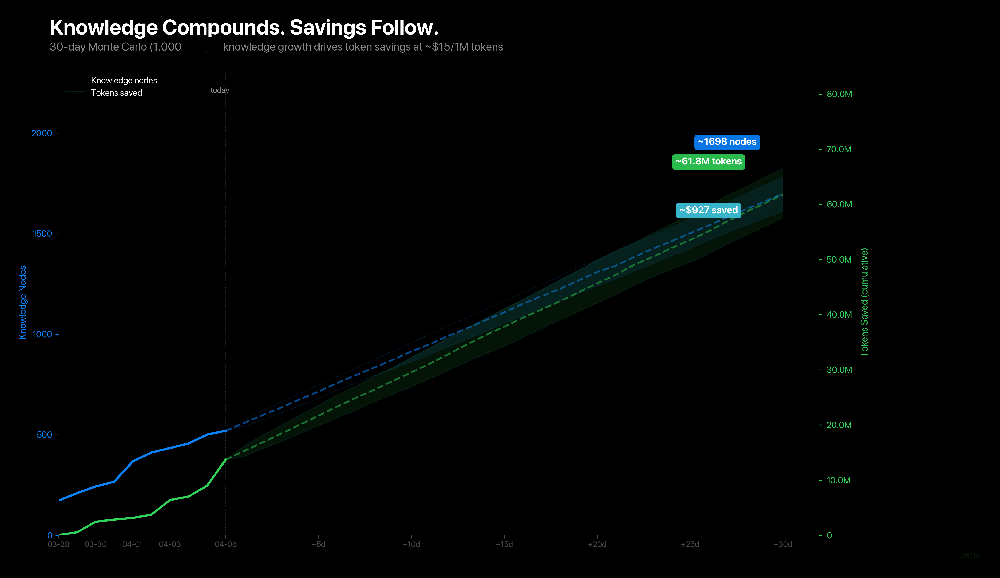

<p align="center">
  
</p>

<h2 align="center">One local memory system for every coding agent you use.</h2>
<p align="center">
  Cortex gives Claude Code, Codex, Cursor, Gemini, and local LLM workflows a shared brain that survives restarts,
  compresses boot context, and stays on your machine.
</p>

<p align="center">
  <a href="https://github.com/AdityaVG13/cortex/releases/latest">Install or download</a> |
  <a href="Info/connecting.md">Connect your tools</a> |
  <a href="Info/research.md">Read the research</a> |
  <a href="Info/roadmap.md">View the roadmap</a>
</p>

<p align="center">
  <a href="https://github.com/AdityaVG13/cortex/releases/tag/v0.4.1"></a>
  <a href="LICENSE"></a>
  <a href="Info/connecting.md"></a>
  <a href="Info/mcp-tools.md"></a>
</p>

<p align="center">
  <a href="#see-the-payoff">Proof</a> |
  <a href="#why-teams-keep-it-running">Why it works</a> |
  <a href="#works-with-your-stack">Stack</a> |
  <a href="#quickstart">Quickstart</a> |
  <a href="#what-ships-in-the-box">What ships</a> |
  <a href="#built-in-public-backed-by-research">Research</a> |
  <a href="#documentation">Docs</a> |
  <a href="#security-and-roadmap">Security</a>
</p>

<p align="center">
  <strong>Cortex exists for one reason:</strong> memory should feel like infrastructure, not a party trick.
</p>

<table>
  <tr>
    <td width="25%" align="center"><strong>10.7M</strong><br><sub>boot tokens saved</sub></td>
    <td width="25%" align="center"><strong>99%</strong><br><sub>live avg compression</sub></td>
    <td width="25%" align="center"><strong>90%</strong><br><sub>benchmark hit rate</sub></td>
    <td width="25%" align="center"><strong>97.5ms</strong><br><sub>avg recall latency</sub></td>
  </tr>
</table>

## See the payoff

Memory products are easy to demo and hard to trust. Cortex only gets interesting once the savings show up on screen.

<p align="center">
  
</p>

<p align="center"><em>Live Cortex analytics: saved tokens, compression, recall quality, boot history, and agent activity in one operator surface.</em></p>

The Control Center is there to answer the uncomfortable question fast: "Is this thing actually paying for itself?" If the answer is no, you should know that immediately. If the answer is yes, the page makes it obvious.

<p align="center">
  
</p>

<p align="center"><em>Monte Carlo savings horizon: a restrained 30-day projection built from real Cortex benchmark data, not marketing math.</em></p>

Source notes: live savings and compression figures come from the current Control Center surface. Retrieval metrics come from [`benchmark/baseline-v041.md`](benchmark/baseline-v041.md).

## Why teams keep it running

<table>
  <tr>
    <td width="33%" valign="top">

### One memory layer, not five

Store an architectural rule, coding convention, or hard-won bug fix once. Claude Code, Codex, Cursor, Gemini, and your own local workflows can all recall it through the same daemon.

    </td>
    <td width="33%" valign="top">

### Boot prompts stop ballooning

Cortex compiles a boot prompt instead of replaying raw history. The result is smaller context, faster warm starts, and less time spent re-explaining the same project to the same tools.

    </td>
    <td width="33%" valign="top">

### You can inspect the system

SQLite backs the memory, ONNX handles embeddings locally, and the Control Center shows what is happening. No black box, no mandatory cloud service, no mystery bill.

    </td>
  </tr>
</table>

## Works with your stack

<table>
  <tr>
    <td width="20%" valign="top">

### Claude Code

Primary plugin path with lifecycle handled for you.

    </td>
    <td width="20%" valign="top">

### Codex

Native MCP bridge plus HTTP fallback when you need it.

    </td>
    <td width="20%" valign="top">

### Cursor

Shared local memory through the same daemon instead of a separate silo.

    </td>
    <td width="20%" valign="top">

### Gemini

Works through MCP for CLI and tool-driven workflows.

    </td>
    <td width="20%" valign="top">

### Local LLMs

Use HTTP or MCP from your own orchestration stack, desktop app, or agent runtime.

    </td>
  </tr>
</table>

## Quickstart

### Recommended: Claude Code plugin

```bash
claude plugin marketplace add AdityaVG13/cortex
claude plugin install cortex@cortex-marketplace
```

Restart your session and Cortex will bootstrap itself.

### Desktop app

Download the latest installer from the [release page](https://github.com/AdityaVG13/cortex/releases/latest).

<details>
<summary>Desktop installers and daemon archives</summary>

| Platform | Installer | Daemon only |
|---|---|---|
| Windows | [`.exe` (NSIS installer)](https://github.com/AdityaVG13/cortex/releases/latest) | [`cortex-v0.4.1-windows-x86_64.zip`](https://github.com/AdityaVG13/cortex/releases/download/v0.4.1/cortex-v0.4.1-windows-x86_64.zip) |
| macOS | [`.dmg`](https://github.com/AdityaVG13/cortex/releases/latest) | [`cortex-v0.4.1-macos-aarch64.tar.gz`](https://github.com/AdityaVG13/cortex/releases/download/v0.4.1/cortex-v0.4.1-macos-aarch64.tar.gz) |
| Linux | [`.AppImage` / `.deb`](https://github.com/AdityaVG13/cortex/releases/latest) | [`cortex-v0.4.1-linux-x86_64.tar.gz`](https://github.com/AdityaVG13/cortex/releases/download/v0.4.1/cortex-v0.4.1-linux-x86_64.tar.gz) |

</details>

### From source

```bash
git clone https://github.com/AdityaVG13/cortex.git
cd cortex/daemon-rs
cargo build --release
```

When Cortex boots cleanly, you should see a READY message and an active memory count. From there, the workflow is simple: store a decision once, stop re-explaining it later.

## What ships in the box

<table>
  <tr>
    <td width="33%" valign="top">

### Capsule compiler

Builds boot prompts from stable identity plus recent delta instead of replaying raw context.

    </td>
    <td width="33%" valign="top">

### Hybrid retrieval

Blends keyword, semantic, and fused ranking locally so useful memory rises faster.

    </td>
    <td width="33%" valign="top">

### MCP and HTTP surfaces

Use Cortex from coding agents, local apps, scripts, or your own orchestration layer.

    </td>
  </tr>
  <tr>
    <td width="33%" valign="top">

### Local embeddings

Runs `all-MiniLM-L6-v2` in-process through ONNX, with no external inference requirement.

    </td>
    <td width="33%" valign="top">

### Governance and conflict handling

Supports decay, supersession, dispute handling, and future provenance-aware memory work.

    </td>
    <td width="33%" valign="top">

### Control Center

Gives operators a visual surface for health, savings, activity, and memory-system behavior.

    </td>
  </tr>
</table>

## Built in public, backed by research

Cortex is open about where ideas came from and where they changed shape. The research page is not a citation dump. It spells out what looked promising, what Cortex adapted, what shipped, and what is still waiting on the roadmap.

| Reference | Why it matters here |
|---|---|
| ByteRover | Helped shape progressive retrieval and the longer-term memory-tier model. |
| Reciprocal Rank Fusion | Provides the ranking fusion rule behind the current retrieval stack. |
| Memori | Informs the planned move toward stronger semantic structure and dedup. |
| A-MAC, MemoryOS, FluxMem | Push the roadmap toward admission control, maturity tiers, and memory crystallization. |

Full paper list, adaptation notes, and status tracking: [Info/research.md](Info/research.md)

## Documentation

<table>
  <tr>
    <td width="33%" valign="top">

### Connect Cortex

[Info/connecting.md](Info/connecting.md) covers Claude Code, Codex, Cursor, Gemini, MCP, HTTP, auth, and the troubleshooting path.

    </td>
    <td width="33%" valign="top">

### Research and roadmap

[Info/research.md](Info/research.md) and [Info/roadmap.md](Info/roadmap.md) show what shipped, what is planned, and why.

    </td>
    <td width="33%" valign="top">

### Security and contribution

[security/SECURITY.md](security/SECURITY.md), [CONTRIBUTING.md](CONTRIBUTING.md), and [CODE_OF_CONDUCT.md](CODE_OF_CONDUCT.md) cover trust, reporting, and project standards.

    </td>
  </tr>
</table>

<details>
<summary>Open the docs map and CLI reference</summary>

### Docs map

- [README.md](README.md) - product overview and install path
- [Info/connecting.md](Info/connecting.md) - AI and tool integration quickstart
- [Info/mcp-tools.md](Info/mcp-tools.md) - MCP tool list and parameters
- [Info/research.md](Info/research.md) - papers, inspirations, and Cortex adaptation notes
- [Info/roadmap.md](Info/roadmap.md) - public roadmap
- [Info/team-mode-setup.md](Info/team-mode-setup.md) - shared team-memory setup
- [security/SECURITY.md](security/SECURITY.md) - security posture and reporting

### CLI reference

| Command | Description |
|---|---|
| `cortex serve` | Start the Cortex daemon |
| `cortex --help` | Show command reference plus troubleshooting guidance |
| `cortex doctor` | Run integrity and configuration diagnostics |
| `cortex paths --json` | Output canonical file and port paths |
| `cortex plugin ensure-daemon` | Start or reuse the daemon with migration and lock safety |
| `cortex plugin mcp` | Bridge MCP stdio to the Cortex HTTP API |
| `cortex setup --team` | Initialize team mode and generate API keys |
| `cortex export` | Export data in `json` or `sql` format |
| `cortex import` | Import a JSON export into solo or team mode |

</details>

## Security and roadmap

- Cortex defaults to a localhost-only surface and bearer-token auth. The token lives under `~/.cortex/cortex.token`.
- The v0.5.0 direction is retrieval hardening, storage governance, public research traceability, and sharper operator surfaces.
- Longer-term work includes admission control, maturity tiers, provenance-aware multi-agent memory, and adaptive compression.

Roadmap details: [Info/roadmap.md](Info/roadmap.md)

<p align="center">
  <a href="https://ko-fi.com/adityavg13">Support Cortex</a> |
  <a href="Info/research.md">Research</a> |
  <a href="Info/connecting.md">Connecting</a> |
  <a href="security/SECURITY.md">Security</a> |
  <a href="CONTRIBUTING.md">Contributing</a> |
  <a href="CODE_OF_CONDUCT.md">Code of Conduct</a> |
  <a href="CHANGELOG.md">Changelog</a> |
  <a href="LICENSE">License</a>
</p>
