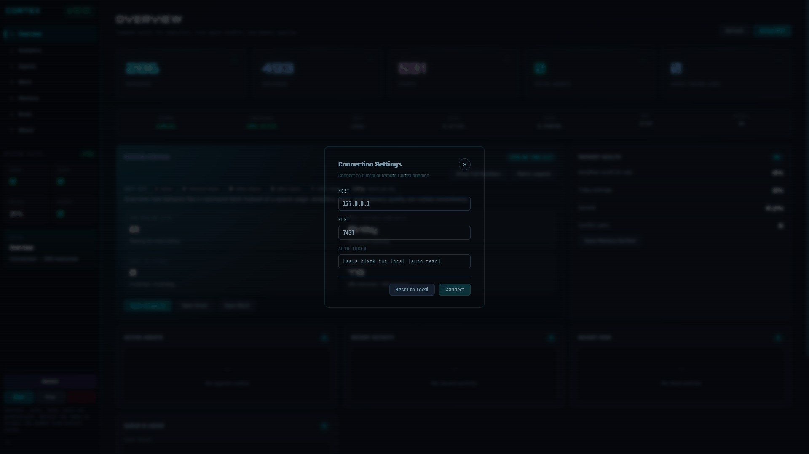
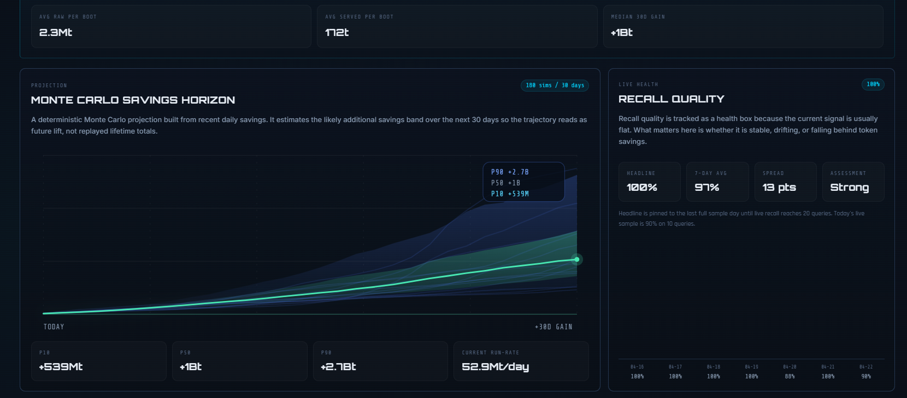

<p align="center">
  
</p>

<h1 align="center">Cortex</h1>
<p align="center"><b>Private local memory for your AI tools.</b><br>
Install once. Your tools stop starting from scratch.</p>

<p align="center">
  <a href="https://ko-fi.com/adityavg13">
    
  </a>
</p>

<p align="center">
  <a href="https://github.com/AdityaVG13/cortex/releases/tag/v0.5.0"></a>&nbsp;
  <a href="LICENSE"></a>&nbsp;
  &nbsp;
  
</p>

<p align="center">
  <a href="https://github.com/AdityaVG13/cortex/releases/latest">Download</a>&nbsp;&nbsp;·&nbsp;&nbsp;
  <a href="Info/connecting.md">Connect your tools</a>&nbsp;&nbsp;·&nbsp;&nbsp;
  <a href="CHANGELOG.md">What's new</a>&nbsp;&nbsp;·&nbsp;&nbsp;
  <a href="Info/roadmap.md">Roadmap</a>
</p>

<p align="center">
  &nbsp;
  &nbsp;
  &nbsp;
  &nbsp;
  &nbsp;
  
</p>

---

<p align="center">
  
  <br><sub>Control Center: analytics, agents, brain state, and about — in one place.</sub>
</p>

Cortex runs a local daemon that stores decisions, context, and lessons across every AI session you run. Claude Code, Codex, Cursor, Gemini, and your own scripts share the same memory through HTTP or MCP. New sessions pick up where the last one left off instead of starting cold.

<p align="center">
  🔒 <b>Private by default</b> — localhost only, data never leaves your machine<br>
  🔗 <b>One memory, every tool</b> — HTTP and MCP, same brain, no per-tool silos<br>
  📊 <b>Prove it works</b> — token savings, recall quality, and Monte Carlo projections
</p>

---


Memory tools are easy to pitch and hard to trust. Cortex starts to matter when the savings stop looking theoretical.

<table>
<tr>
<td width="58%">


</td>
<td width="42%" valign="top">

### Compounding memory economics

Every session that reuses context instead of rebuilding it saves tokens. Cortex tracks each one:

- **Token savings per session** — boot prompts vs raw file baselines
- **Recall hit rate** — what percentage of queries find useful context
- **Compression ratios** — how much Cortex compresses vs what tools would have re-read
- **Agent activity heatmap** — which tools use memory most and when

The savings compound. Week one saves hundreds of tokens. Week four saves tens of thousands.

</td>
</tr>
</table>

<table>
<tr>
<td width="42%" valign="top">

### Monte Carlo savings horizon

Cortex projects your savings forward using Monte Carlo simulation on your actual usage data — not synthetic benchmarks.

- Based on your real boot frequency, recall patterns, and compression history
- 30-day projection with confidence intervals
- Updates as your usage patterns change

If the projection looks wrong, the underlying data is visible in the analytics panel. No black boxes.

</td>
<td width="58%">



</td>
</tr>
</table>

---


Cortex recall quality is measured against a 20-query ground-truth dataset on every release. The benchmark uses the raw daemon with no helpers, no prompt engineering, and no query rewriting — just the retrieval stack on its own.

<p align="center">

**18/20** top-1 hit rate &nbsp;&nbsp;·&nbsp;&nbsp; **87.5%** precision &nbsp;&nbsp;·&nbsp;&nbsp; **95%** MRR &nbsp;&nbsp;·&nbsp;&nbsp; **48 avg** query tokens

</p>

Two queries currently return the relevant result at position 2 instead of position 1. Retrieval quality is under active development — RRF weighting, reranking, and query expansion improvements are planned for v0.6.0+. The v0.4.1 baseline started at 55% ground-truth precision; current retrieval (RRF + crystal families + synonym expansion) is a significant step forward, with more to come.

[Raw Benchmark JSON](benchmarking/results/raw-recall-no-helper-dev-20260421-224217.json) · [Helper Benchmark JSON](benchmarking/results/helper-benchmark-cortex-http-20260419.json)

---


349 commits since v0.4.1. Full details in [CHANGELOG.md](CHANGELOG.md).

### Retrieval

- **Reciprocal rank fusion** — query-adaptive keyword/semantic weighting
- **Crystal family recall** — collapsed members cut token cost, preserve context
- **Synonym-expanded keywords** across all retrieval paths
- FTS tokenizer upgrade and BM25 tuning
- Entity-alignment boost, co-occurrence expansion

### Reliability

- Schema migration framework with upgrade regression tests
- DB integrity gate, rolling backups, crash-safe WAL
- Storage pressure governor with event-pressure controls
- Persistent savings rollups for long-window analytics
- DB footprint: 720 MB → 386 MB in a real install

### Agent intelligence

- **Feedback telemetry** — record outcomes, track reliability over time
- **Recall explainability** — see why results ranked the way they did
- **Conflict detection** — AGREES / CONTRADICTS / REFINES / UNRELATED
- **Client permissions** — read / write / admin gates per agent

### Security

- Localhost exempt from auth-failure lockout
- Non-loopback binds require TLS
- API key masking on non-interactive stdout
- Remote targets need explicit token (no silent auto-load)
- Team-mode destructive ops require admin + rated auth

---


Cortex tracks active agent sessions when clients identify themselves through `cortex_boot` or `GET /boot?agent=NAME`.

<table>
<tr>
<td width="55%">


</td>
<td width="45%" valign="top">

### Multi-agent, one brain

- Each boot call registers a session. Control Center shows active sessions, **deduplicated by agent identity**.
- Read-path tools (recall, peek, unfold) reattach to existing sessions — no duplicates.
- Session descriptions preserved across reconnects and daemon restarts.
- What one agent stores, every other agent can recall.

Claude Code, Codex, Cursor, Gemini, and custom scripts can all be connected simultaneously. Each tracks its own session while sharing the same memory.

</td>
</tr>
</table>

---


| Tool | Connection | Setup |
|------|-----------|-------|
| **Claude Code** | MCP (plugin) or desktop app | Plugin: `claude plugin install cortex@cortex-marketplace` |
| **Codex** | MCP | `codex mcp add cortex -- cortex.exe mcp --agent codex` |
| **Cursor** | MCP | Point MCP server at `cortex mcp --agent cursor` |
| **Factory Droid** | MCP | `cortex mcp --agent droid` |
| **Aider** | CLI / HTTP | `cortex boot --agent aider` |
| **Custom tools** | HTTP | Three endpoints: `/boot`, `/recall`, `/store` |
| **Local LLMs** | HTTP / MCP | Same protocol, any runtime |

Full setup guide: **[Info/connecting.md](Info/connecting.md)**

---


### Desktop app (Control Center)

Download from the [release page](https://github.com/AdityaVG13/cortex/releases/latest). The Control Center manages daemon lifecycle for you.

| Platform | Desktop installer | Daemon archive |
|----------|------------------|----------------|
| **Windows** | [`.exe` (NSIS installer)](https://github.com/AdityaVG13/cortex/releases/latest) | [`.zip`](https://github.com/AdityaVG13/cortex/releases/latest) |
| **macOS** | [`.dmg`](https://github.com/AdityaVG13/cortex/releases/latest) | [`.tar.gz`](https://github.com/AdityaVG13/cortex/releases/latest) |
| **Linux** | [`.AppImage` / `.deb`](https://github.com/AdityaVG13/cortex/releases/latest) | [`.tar.gz`](https://github.com/AdityaVG13/cortex/releases/latest) |

### From source

```bash
git clone https://github.com/AdityaVG13/cortex.git
cd cortex/daemon-rs
cargo build --release
```

### Claude Code plugin

```bash
claude plugin marketplace add AdityaVG13/cortex
claude plugin install cortex@cortex-marketplace
```

The plugin handles daemon startup, health checks, and MCP bridging automatically.

---


Cortex enforces a **single-daemon invariant** — only one daemon process runs at a time.

| Mode | How it works |
|------|-------------|
| **Desktop app** | Control Center owns the daemon. Restart and monitor from the app. |
| **CLI** | `cortex serve` starts the daemon. Exits cleanly if one is already running. |
| **Plugin** | `cortex plugin ensure-daemon` attaches to an existing daemon or starts one. |

Default bind: `127.0.0.1:7437`. Non-loopback binds require TLS. Auth token at `~/.cortex/cortex.token`.

If using the Control Center, manage the daemon from there. Do not run a second `cortex serve` alongside it.

---


After installing, verify everything works:

```bash
# Start the daemon (skip if using Control Center)
cortex serve &

# Health check (no auth required)
curl http://localhost:7437/health

# Boot test
TOKEN=$(cat ~/.cortex/cortex.token)
curl -H "Authorization: Bearer $TOKEN" \
     -H "X-Cortex-Request: true" \
     "http://localhost:7437/boot?agent=smoke-test"

# Store and recall round-trip
curl -X POST http://localhost:7437/store \
     -H "Content-Type: application/json" \
     -H "Authorization: Bearer $TOKEN" \
     -H "X-Cortex-Request: true" \
     -d '{"decision": "smoke test", "context": "verifying install"}'

curl -H "Authorization: Bearer $TOKEN" \
     -H "X-Cortex-Request: true" \
     "http://localhost:7437/recall?q=smoke+test"
```

<details>
<summary>Development build verification</summary>

```bash
# Daemon unit tests
cargo test --manifest-path daemon-rs/Cargo.toml

# Desktop test suite
npm --prefix desktop/cortex-control-center test

# Lifecycle smoke test
npm --prefix desktop/cortex-control-center run verify:lifecycle:dev

# Security audit
npm audit --omit=dev --audit-level=high
cargo audit
```

</details>

---


| Document | Covers |
|----------|--------|
| **[Connecting](Info/connecting.md)** | Setup, MCP, HTTP, auth, troubleshooting |
| **[MCP Tools](Info/mcp-tools.md)** | All 28 MCP tool definitions and parameters |
| **[Research](Info/research.md)** | Papers, inspirations, adaptation notes |
| **[Roadmap](Info/roadmap.md)** | What shipped, what's planned, and why |
| **[Security](Info/security-rules.md)** | Threat model, auth rules, vulnerability reporting |
| **[Team mode](Info/team-mode-setup.md)** | Shared-server setup for engineering teams |
| **[Contributing](CONTRIBUTING.md)** | Development setup and PR guidelines |

<details>
<summary>CLI reference</summary>

| Command | Description |
|---------|-------------|
| `cortex serve` | Start the daemon |
| `cortex --help` | Full command reference |
| `cortex doctor` | Run diagnostics |
| `cortex paths --json` | Show file and port paths |
| `cortex plugin ensure-daemon` | Ensure daemon health (plugin mode) |
| `cortex plugin mcp` | MCP stdio bridge to HTTP API |
| `cortex setup --team` | Initialize team mode and generate API keys |
| `cortex export` | Export data (json or sql) |
| `cortex import` | Import from a previous export |

</details>

---


Cortex defaults to localhost-only access with bearer-token auth. Full threat model, auth rules, and vulnerability reporting:

**[Info/security-rules.md](Info/security-rules.md)**

---

<p align="center">
  <a href="https://ko-fi.com/adityavg13"><b>☕ Support Cortex</b></a>&nbsp;&nbsp;·&nbsp;&nbsp;
  <a href="Info/research.md">Research</a>&nbsp;&nbsp;·&nbsp;&nbsp;
  <a href="Info/connecting.md">Connecting</a>&nbsp;&nbsp;·&nbsp;&nbsp;
  <a href="Info/security-rules.md">Security</a>&nbsp;&nbsp;·&nbsp;&nbsp;
  <a href="CONTRIBUTING.md">Contributing</a>&nbsp;&nbsp;·&nbsp;&nbsp;
  <a href="CODE_OF_CONDUCT.md">Code of Conduct</a>&nbsp;&nbsp;·&nbsp;&nbsp;
  <a href="CHANGELOG.md">Changelog</a>&nbsp;&nbsp;·&nbsp;&nbsp;
  <a href="LICENSE">MIT License</a>
</p>
