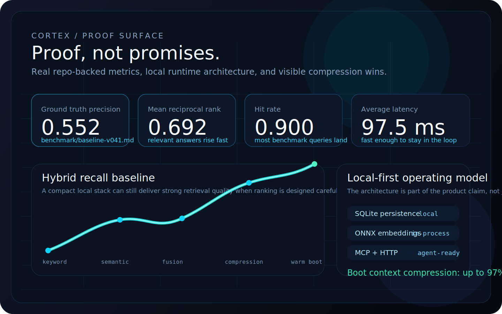
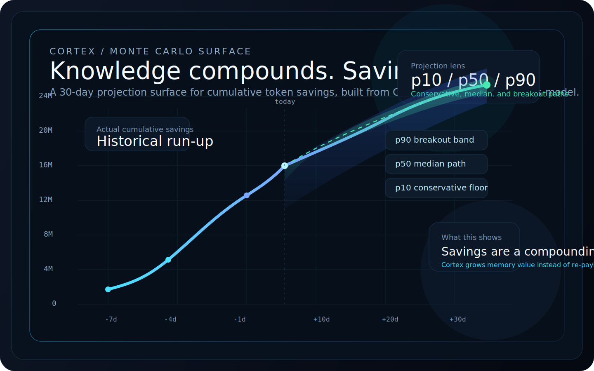
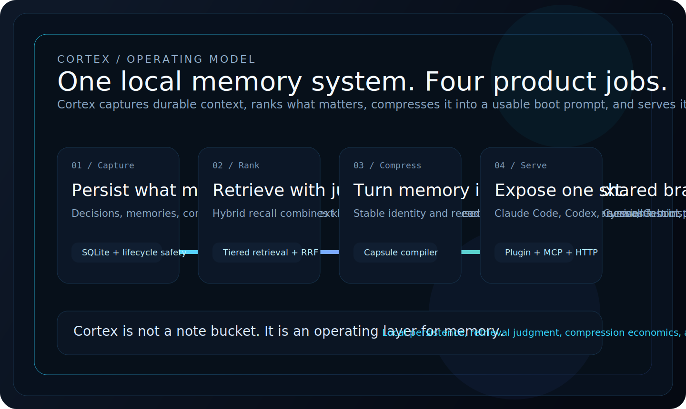
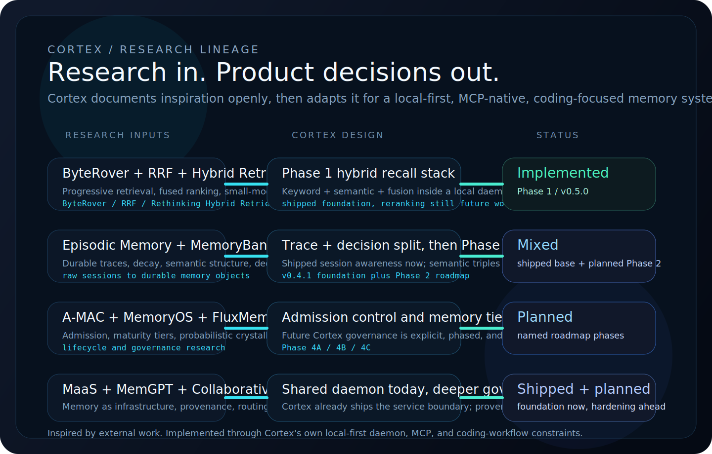

<p align="center">
  
</p>

<h3 align="center">The local memory layer for serious AI coding workflows.</h3>
<h4 align="center">Persistent context, hybrid recall, boot compression, and MCP-native tooling in one Rust system.</h4>

<p align="center">
  <a href="https://github.com/AdityaVG13/cortex/releases/tag/v0.4.1"></a>
  <a href="https://github.com/AdityaVG13/cortex/blob/master/LICENSE"></a>
  <a href="https://github.com/AdityaVG13/cortex"></a>
  <a href="https://github.com/AdityaVG13/cortex"></a>
  <a href="https://github.com/AdityaVG13/cortex"></a>
</p>

<p align="center"><strong>Current release:</strong> <a href="https://github.com/AdityaVG13/cortex/releases/tag/v0.4.1">v0.4.1</a></p>

<p align="center">
  <a href="#proof-not-promises">Proof</a> --
  <a href="#why-cortex-exists">Why Cortex</a> --
  <a href="#installation">Installation</a> --
  <a href="#works-with-your-stack">Stack</a> --
  <a href="#desktop-app">Desktop App</a> --
  <a href="#built-on-research">Research</a> --
  <a href="#documentation-map">Docs</a> --
  <a href="SECURITY.md">Security</a> --
  <a href="Info/roadmap.md">Roadmap</a>
</p>

---

<p align="center">
  <strong>Cortex gives Claude Code, Codex, Cursor, Gemini, and local LLM workflows one shared brain that survives across sessions.</strong><br>
  It keeps memory local, compresses boot context, and exposes recall through MCP and HTTP instead of burying state inside one assistant.
</p>

<p align="center">
  <a href="https://ko-fi.com/adityavg13">Support Cortex</a> - donations fund API costs, compute, tooling, and release work.
</p>

Cortex exists because coding agents still lose too much context between sessions. Every restart costs time, tokens, and trust. Cortex turns long-term memory into local infrastructure: SQLite for persistence, ONNX for embeddings, MCP for agent access, and a desktop control center for inspection and governance.

<p align="center">
  <strong>Built for Claude Code, Codex, Cursor, Gemini, and local LLM stacks that need one durable brain instead of five separate memory silos.</strong>
</p>

## Proof, Not Promises

<p align="center">
  
</p>

### Compounding Savings

<p align="center">
  
</p>

The surface above turns the analytics model into a public product claim: memory is not just stored, it compounds. Cortex can estimate a likely 30-day savings range from recent daily behavior, making the compression story visible instead of leaving it as an abstract percentage.

| Signal | Current baseline | Why it matters |
|---|---:|---|
| Ground truth precision | `0.552` | Cortex is already surfacing relevant project memory in benchmarked recall runs. |
| MRR | `0.692` | Relevant answers are often near the top instead of buried deep in the stack. |
| Hit rate | `0.900` | Cortex is finding at least one relevant result for most benchmark queries. |
| Avg latency | `97.5 ms` | The stack stays fast enough to sit in the loop during normal coding sessions. |
| Boot compression | `~97%` | Boot context is already being compressed aggressively before it reaches the model. |

Source notes: retrieval metrics come from [`benchmark/baseline-v041.md`](benchmark/baseline-v041.md). Compression tracking is documented in [`Info/connecting.md`](Info/connecting.md).

## Why Cortex Exists

<p align="center">
  
</p>

The point of Cortex is not "more memory." The point is reliable memory that feels operational, local, and worth trusting inside a real coding workflow.

| You are fighting | Cortex answers with |
|---|---|
| Session amnesia | Capsule boot prompts that compile durable identity plus recent delta. |
| Memory silos between tools | A shared local daemon with MCP and HTTP surfaces. |
| Context bloat | Progressive retrieval, compression, decay, and future lifecycle controls. |
| Contradictory agent behavior | Conflict detection, supersession, and human-resolvable disputes. |
| Cloud-only memory products | Local SQLite, in-process ONNX, zero mandatory external services. |

## Installation

### Claude Code Plugin
Cortex is available as a primary Claude Code plugin and handles daemon lifecycle for you.

```bash
claude plugin marketplace add AdityaVG13/cortex
claude plugin install cortex@cortex-marketplace
```

Restart your session and Cortex is available.

### Desktop App
Download the installer for your platform from the [latest release](https://github.com/AdityaVG13/cortex/releases/latest).

| Platform | Installer | Daemon only |
|---|---|---|
| Windows | [`.exe` (NSIS installer)](https://github.com/AdityaVG13/cortex/releases/latest) | [`cortex-v0.4.1-windows-x86_64.zip`](https://github.com/AdityaVG13/cortex/releases/download/v0.4.1/cortex-v0.4.1-windows-x86_64.zip) |
| macOS | [`.dmg`](https://github.com/AdityaVG13/cortex/releases/latest) | [`cortex-v0.4.1-macos-aarch64.tar.gz`](https://github.com/AdityaVG13/cortex/releases/download/v0.4.1/cortex-v0.4.1-macos-aarch64.tar.gz) |
| Linux | [`.AppImage` / `.deb`](https://github.com/AdityaVG13/cortex/releases/latest) | [`cortex-v0.4.1-linux-x86_64.tar.gz`](https://github.com/AdityaVG13/cortex/releases/download/v0.4.1/cortex-v0.4.1-linux-x86_64.tar.gz) |

### From Source

```bash
git clone https://github.com/AdityaVG13/cortex.git
cd cortex/daemon-rs
cargo build --release
```

## Works With Your Stack

| Interface | Best for | Notes |
|---|---|---|
| Claude Code plugin | Fastest setup | Primary install path with lifecycle handled automatically. |
| MCP server | Codex, Cursor, Gemini CLI, local tooling | Native memory access for any MCP-capable workflow. |
| HTTP API | Custom apps and local LLM orchestration | Good for bespoke tooling and desktop/web surfaces. |
| Team mode | Shared engineering memory | Run Cortex on a server and give the whole team a common brain. |

| Component | Windows x86_64 | macOS arm64 | Linux x86_64 |
|---|---|---|---|
| Daemon binary (`cortex`) | Yes | Yes | Yes |
| Claude plugin runtime archive | Yes (`.zip`) | Yes (`.tar.gz`) | Yes (`.tar.gz`) |
| Control Center desktop app | Yes (`.exe`) | Yes (`.dmg`) | Yes (`.AppImage`, `.deb`) |

### First Session Experience

When Cortex boots cleanly, you will see something like:

```text
Brain: READY | Cortex initialized at ~/.cortex | 42 memories
```

The immediate win is simple: store a convention once, then stop re-explaining it. Architecture decisions, review preferences, naming rules, and debugging lessons can all survive into later sessions.

### Team Mode

Run a shared instance on a server to give your whole engineering team a collective memory.

1. Run `CORTEX_BIND=0.0.0.0 cortex serve` on the server.
2. Initialize with `cortex setup --team`.
3. Team members connect with the server URL and API key through the plugin or Control Center.

Detailed guide: [Info/team-mode-setup.md](Info/team-mode-setup.md)

## Desktop App

<p align="center">
  
</p>

The Control Center gives Cortex a visual surface for operators, not just a terminal pipe. It exposes token savings, boot history, daemon health, Monte Carlo savings horizons, and agent activity in the same visual language now shaping the public docs: dense information, clear hierarchy, and strong contrast instead of generic dashboard chrome.

## How It Works

| Component | Description |
|---|---|
| Capsule compiler | Compiles boot prompts from stable identity and recent delta. |
| Progressive retrieval | Supports peek, unfold, and full recall instead of one blunt search pass. |
| Hybrid ranking | Blends keyword, semantic, and fused ranking signals locally. |
| In-process ONNX | Uses `all-MiniLM-L6-v2` without an external inference service. |
| Conflict handling | Detects contradictions and preserves a path for human resolution. |
| Auto-respawn | Lets the MCP proxy recover daemon loss without collapsing the whole workflow. |

Connection and auth details live in [CONNECTING.md](CONNECTING.md).

## Built on Research

<p align="center">
  
</p>

Cortex is built in public, and its research surface is public too. The project is not pretending papers were "implemented directly"; it is explicit about which ideas were inspiring, which ones shipped, and which ones are still on the roadmap.

The graphic above is intentionally simplified so it stays readable at a glance. The full paper-by-paper record explains what Cortex liked, how it changed each idea for its own constraints, and where that work lands in the product.

| Reference | Why it matters to Cortex |
|---|---|
| ByteRover (2026) | Helped shape Phase 1 progressive retrieval and the later memory-tier roadmap. |
| Reciprocal Rank Fusion (2009) | Gave Cortex the fusion rule behind its multi-retriever ranking stack. |
| Memori (2026) | Informs the planned move toward semantic structure and stronger dedup in Phase 2. |
| A-MAC + MemoryOS + FluxMem (2025-2026) | Shape the next wave of admission control, maturity tiers, and crystallization logic. |

Full research map, adaptation notes, and status tracking: [Info/research.md](Info/research.md)

## Documentation Map

- [README.md](README.md) - install and product overview
- [CONNECTING.md](CONNECTING.md) - AI and tool integration quickstart
- [Info/research.md](Info/research.md) - papers, inspiration, and adaptation notes behind Cortex
- [Info/roadmap.md](Info/roadmap.md) - public roadmap
- [SECURITY.md](SECURITY.md) - threat model and security posture
- [CONTRIBUTING.md](CONTRIBUTING.md) - development workflow
- [CODE_OF_CONDUCT.md](CODE_OF_CONDUCT.md) - community standards

## Core MCP Tools

- `cortex_boot` - compiled boot prompt with session context
- `cortex_recall` - hybrid semantic and keyword search with token budgeting
- `cortex_store` - persist a decision or insight with conflict detection
- `cortex_digest` - daily health digest and token savings analytics
- `cortex_health` - daemon and memory-system health check

Full tool list and parameters: [Info/mcp-tools.md](Info/mcp-tools.md)

## CLI Reference

| Command | Description |
|---|---|
| `cortex serve` | Start the Cortex daemon |
| `cortex --help` | Show command reference plus troubleshooting guidance |
| `cortex paths --json` | Output canonical file and port paths |
| `cortex plugin ensure-daemon` | Start or reuse the daemon with migration and lock safety |
| `cortex plugin mcp` | Bridge MCP stdio to the Cortex HTTP API |
| `cortex setup --team` | Initialize team mode and generate API keys |
| `cortex export` | Export data in `json` or `sql` format |
| `cortex import` | Import a JSON export into solo or team mode |
| `cortex doctor` | Run integrity and configuration diagnostics |

If connectivity or auth looks wrong, start with `cortex --help`, then run `cortex doctor`. Protected HTTP requests also need the requirements documented in [Info/connecting.md](Info/connecting.md).

## Current Edges

- Recall ranking is already useful, but the biggest open quality work is still better reranking and smarter routing for sparse queries.
- The Control Center is actively developing; some panels are stronger than others today.
- First-run experience is better than it used to be, but edge environments can still need manual troubleshooting.

## Security & Roadmap

- Security posture: bearer auth is required, the default surface is localhost-only, and the token lives at `~/.cortex/cortex.token`. See [SECURITY.md](SECURITY.md).
- v0.5.0 direction: retrieval hardening, storage governance, public research traceability, and sharper operational surfaces.
- Longer-term direction: admission control, maturity tiers, provenance-aware multi-agent memory, and adaptive compression.

Roadmap details: [Info/roadmap.md](Info/roadmap.md)

[Research](Info/research.md) | [Connecting](CONNECTING.md) | [Security](SECURITY.md) | [Contributing](CONTRIBUTING.md) | [Code of Conduct](CODE_OF_CONDUCT.md) | [Changelog](CHANGELOG.md) | [License](LICENSE)
